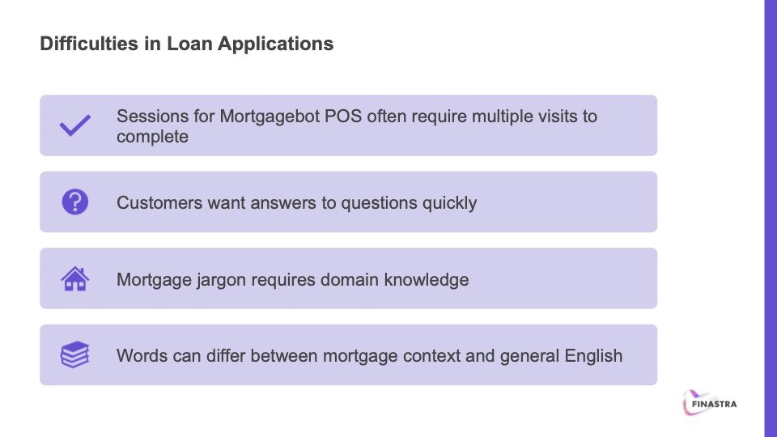
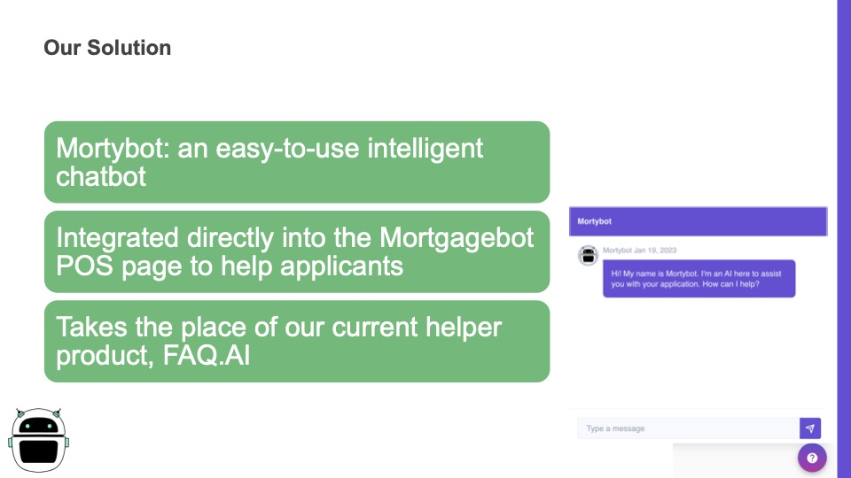
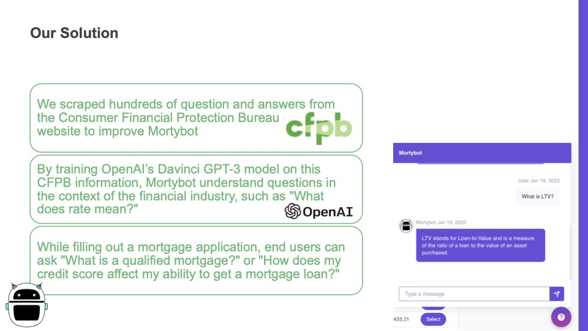
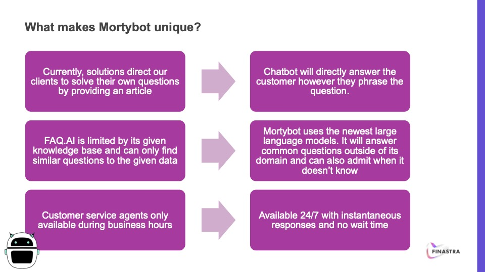
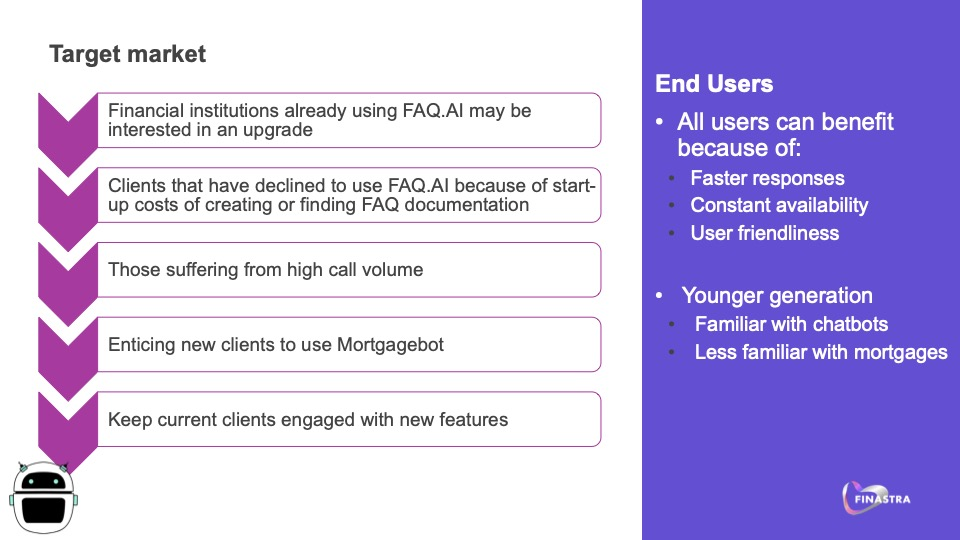
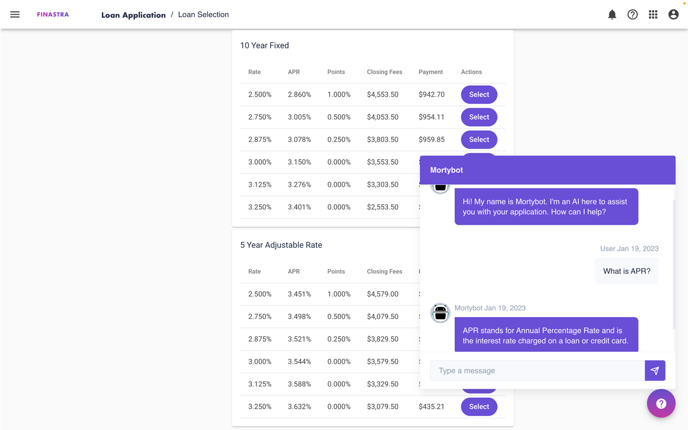
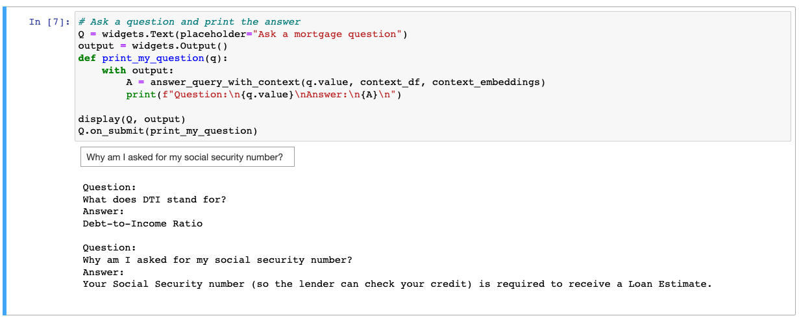

# MortyBot
A GPT-3 powered chat bot that has been fine tuned on Consumer Financial Protection Bureau question and answers. Provides users with simple explanations on common mortgage jargon and helps answer common complex questions.


---

## Problem to solve
Purchasing a house is a major life decision, and a majority of homebuyers need a mortgage. Unfortunately, lenders use jargon like PMI, ARM, and jumbo loans. Who are Fannie Mae and Freddie Mac? Do I want a balloon mortgage? A mortgage applicant’s lack of knowledge can lead to frustration, mistakes, and product steering.

Finastra’s Mortgagebot POS provides an easy-to-use interface for filling out a mortgage. But mortgages are notoriously confusing and Mortgagebot suffers from a lot of application drop-off as customers get frustrated or can't find the information they need to understand how to fill out the forms.




A little over a year ago, we launched FAQ.AI. This powerful tool uses a semantic search within a lender’s frequently asked questions to provide users with the answers they need while filling out their application.

And we’re here to make it even better.

---

## Our solution
Mortybot is an easy-to-use intelligent chatbot that is directly integrated into the Mortgagebot POS page. It helps applicants complete their information with even more aid than FAQ.AI currently provides.



Mortybot uses cutting-edge chatbot technology. It leverages [OpenAI’s GPT-3](https://openai.com/api/), which is the most powerful language model to date. Ask him anything about mortgages and Morty is sure to know!

The [Consumer Financial Protection Bureau](https://www.consumerfinance.gov/consumer-tools/mortgages/), or CFPB, provides a wealth of information for homebuyers. It defines helpful terms, provides resources for veterans, and helps clarify many common issues. While this vast amount of information is theoretically great for consumers, it is often hard to find the answer to your question. And most people don’t even know it exists. But CFPB Morty’s specialty.

Mortybot relies on information scraped from the CFPB’s website, which is used fine-tune the specific GPT-3 model named [Davinci](https://beta.openai.com/docs/models/finding-the-right-model). In GPT’s own words, “fine-tuning is a way to adapt a pre-trained model to a specific task by training it further with a smaller dataset. This allows the model to improve its performance on the specific task.”



Mortybot will take the place of FAQ.AI. Users will be able to ask any mortgage-related question, even if it’s not in a lender’s FAQ documentation. Here are 2 real-life examples:
```
Q: What does LTV stand for?
A: LTV stands for "loan-to-value."

Q: Why am I asked for my social security number?
A: Your Social Security number (so the lender can check your credit) is required to receive a Loan Estimate.
```
  
Mortybot uses text generation to provide answers that are as simple or complex as needed. No sifting through an entire document just to find out that LTV means loan to value.



All of our Mortgagebot customers can benefit from this service. Those already invested in FAQ.AI may wish to upgrade. Clients that have declined to use FAQ.AI because of the time-sucking cost of providing documentation could greatly benefit from the no-effort implantation of Mortybot. The list goes on and on. In short, everyone deserves to meet Mortybot.




---
## Try it out
### Requirements
This project uses Python 3+. Using the [Anaconda](https://anaconda.org/anaconda/python) distribution of Python will provide you with most of the packages required.
To install the other dependencies, run 
`pip install -r requirements.txt`

### How-to use the Chatbot web application
*Angular must be installed*

Open file LoanDenialGPT/src/app/services/openapi.service.ts  
Replace api key with your own api key from OpenAI

```
bash
cd LoanDenialGPT
npm install
ng serve
```
Navigate to http://localhost:4200 in your browser

### How-to use the Chatbot notebook
To try the question answering model using embeddings for yourself, you will need to create an OpenAI account and get an API token. Store this API token as an environment variable on your computer. Clone this repo to your computer and open the question_answer_with_embeddings.ipynb.  
Run all of the cells. Use the widget at the bottom to ask questions.  
Have fun!


